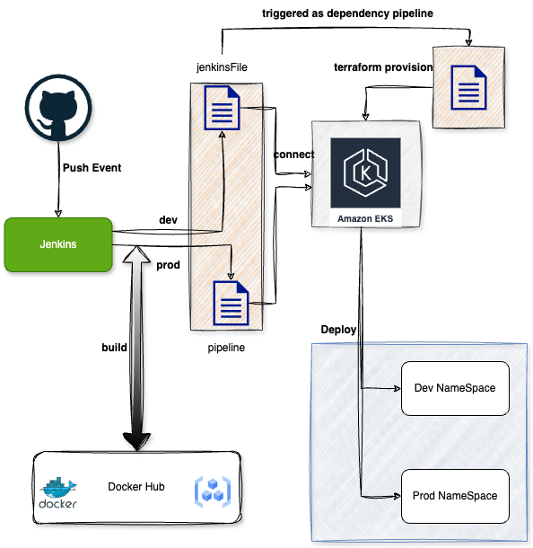
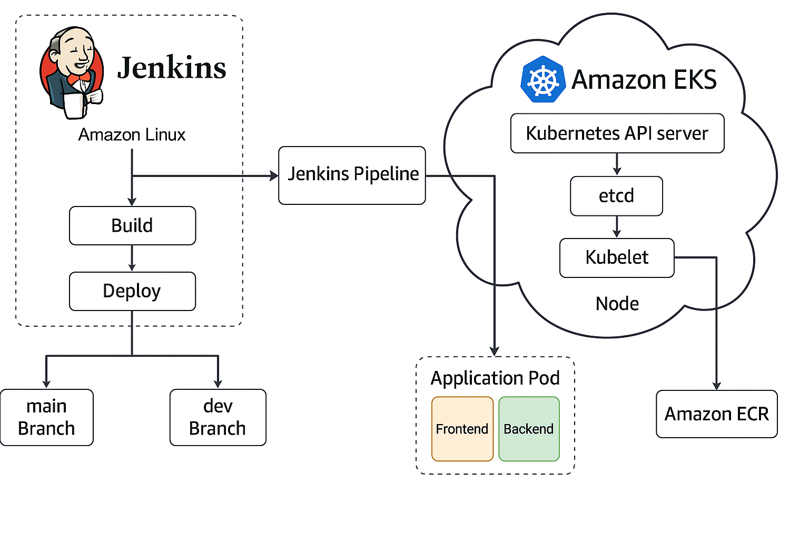

# Jenkins CI/CD with Docker, AWS CLI, Kubectl, and Eksctl on Amazon Linux

This setup runs Jenkins in a Docker container on Amazon Linux EC2. Jenkins is configured with all the necessary tools to build Docker containers, interact with AWS, and deploy to an EKS Kubernetes cluster.

---

## 🚀 Stress Control Platform – CI/CD with Jenkins and EKS

This repository implements a complete DevOps pipeline using **Jenkins**, **Terraform**, **Docker**, and **Amazon EKS**, supporting multi-branch deployment, Kubernetes environments, and GitHub-based automation.

---

## 📁 Folder Structure

```text
.
├── docker-compose.yaml
├── install_jenkins_k8s_docker_tools.sh
├── jenkins/
│   └── init.groovy.d/
│       └── security.groovy
└── README.md
```

## Install All Tools Inside Jenkins Container


Run this after the container starts:
```bash
docker cp install_jenkins_k8s_docker_tools.sh jenkins:/tmp/
docker exec -it jenkins bash -c "chmod +x /tmp/install_jenkins_k8s_docker_tools.sh && /tmp/install_jenkins_k8s_docker_tools.sh"
```


Tools installed:

    Docker CLI

    Docker Compose (v2)

    AWS CLI v2

    kubectl

    eksctl

    terraform

## 📐 Architecture

> 📌 High Level Devops Architecture



### High-Level Workflow

1. **GitHub Push** triggers `job2` (CI/CD pipeline)
2. `job2` pulls EKS output from `job1` (Terraform infrastructure)
3. Jenkins builds and pushes Docker images
4. Kubernetes manifests deployed into namespace per branch
5. Services available on EKS based on environment

---

## 🧪 Jenkins Job Design

### 🛠️ `job1`: EKS Infrastructure Pipeline

- **Type**: Jenkins **Multibranch Pipeline**
- **Purpose**: Manages the creation and updates of EKS infrastructure using Terraform
- **Trigger**: Manual or SCM push to infra branch (e.g., `main`, `eks-prod`, etc.)
- **Output**: Terraform generates `eks_output.txt` or `eks_output.json` containing cluster details
- **Output Consumption**: `job2` fetches these artifacts and uses them for `kubectl` config and deployment

### 🚀 `job2`: CI/CD App Deployment Pipeline

- **Trigger**: Automatically triggered on **GitHub Push**
- **Purpose**: Checks out code, builds Docker images, pushes to DockerHub, and deploys to the appropriate EKS namespace
- **Dependencies**: Consumes Terraform output from `job1`

---

> 📌 High Level Deployment Architecture



## 📁 Repository Structure

| Folder / File      | Description                                      |
|--------------------|--------------------------------------------------|
| `eks/`             | Terraform code to provision EKS and related AWS infra |
| `frontend/`        | React-based frontend app                         |
| `backend/`         | Node.js or Python-based backend service          |
| `k8s/`             | Kubernetes manifests for deployment              |
| `Jenkinsfile`      | Jenkins pipeline definition for CI/CD            |

---

## 🔗 Related GitHub Repositories

| Purpose                           | Repository URL |
|-----------------------------------|----------------|
| App Source Code + Jenkinsfile     | [GitHub Repo 1 Placeholder](https://github.com/rocki9satya/stress-control-app) |
| EKS Terraform Infra Code          | [GitHub Repo 2 Placeholder](https://github.com/rocki9satya/aws-kubernates) |

---

## 🛠️ Prerequisites

- AWS CLI configured
- EKS cluster provisioned (`job1`)
- DockerHub credentials set in Jenkins
- Jenkins with:
  - GitHub webhook configured
  - Required plugins installed (Pipeline, Docker, Terraform, etc.)
  - Credentials: `docker-hub-creds`, `aws-creds`

---

## 🔄 CI/CD Flow

```mermaid
graph TD;
    A[Git Push to GitHub] --> B[Trigger Jenkins job2];
    B --> C[Fetch EKS Outputs from job1];
    C --> D[Build Docker Images];
    D --> E[Push Images to DockerHub];
    E --> F[Apply Kubernetes Manifests];
    F --> G[Deploy to EKS Cluster];


